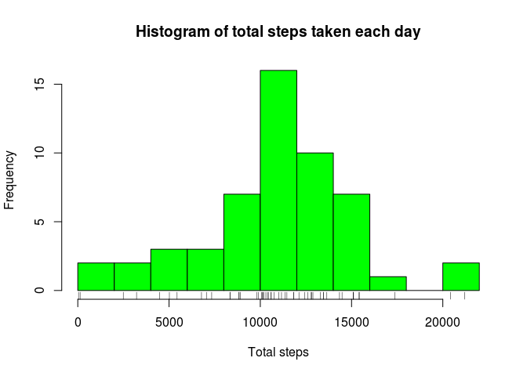
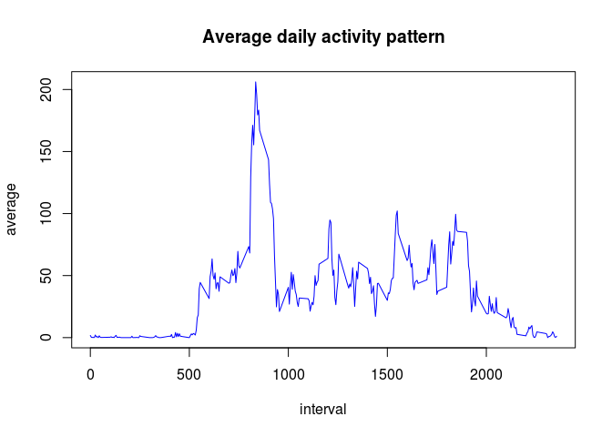
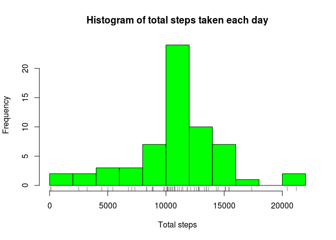
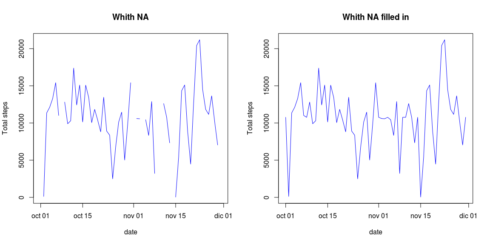
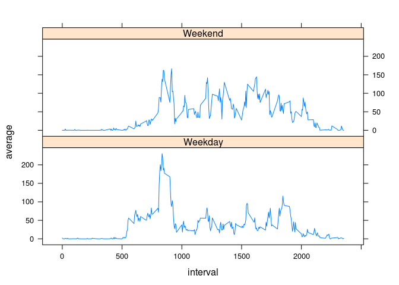

# Reproducible Research: Peer Assessment 1


##Loading and preprocessing the data
Download the data from the github repository and copy the file `activity.csv` in your default working directory


```r
library(dplyr)
library(lubridate)
library(lattice)
```


```r
activity <- read.csv("./activity.csv")
activity$date <- as.Date(activity$date)
```

## What is mean total number of steps taken per day?

Calculate the total number of steps taken per day


```r
day <- 
  activity %>%
  group_by(date) %>%
  summarize(total = sum (steps, na.rm = any(!is.na(steps))))
```

With `sum (steps, na.rm = any(!is.na(steps)))` I want to remove NA and compute where there are partial data while returning NA instead of zero when there are no data at all


```r
summary(day)
```

```
##       date                total      
##  Min.   :2012-10-01   Min.   :   41  
##  1st Qu.:2012-10-16   1st Qu.: 8841  
##  Median :2012-10-31   Median :10765  
##  Mean   :2012-10-31   Mean   :10766  
##  3rd Qu.:2012-11-15   3rd Qu.:13294  
##  Max.   :2012-11-30   Max.   :21194  
##                       NA's   :8
```

Make a histogram of the total number of steps taken each day


```r
with(day, hist(total, col = "green", breaks = 10, main = "Histogram of total steps taken each day", xlab = "Total steps"))
rug(day$total)
```

 

Calculate and report the mean and median of the total number of steps taken per day


```r
mean(day$total, na.rm = T)
```

```
## [1] 10766.19
```

```r
median(day$total, na.rm = T)
```

```
## [1] 10765
```

## What is the average daily activity pattern?

Make a time series plot (i.e. type = "l") of the 5-minute interval (x-axis) and the average number of steps taken, averaged across all days (y-axis)


```r
average <-
  activity %>%
  group_by(interval) %>%
  summarize(average = mean(steps, na.rm = T))
```


```r
with(average, plot(interval, average, type = "l", col = "blue", main = "Average daily activity pattern"))
```

 

Which 5-minute interval, on average across all the days in the dataset, contains the maximum number of steps?


```r
row_max <- filter(average, average == max(average))
row_max$interval
```

```
## [1] 835
```

## Imputing missing values

Calculate and report the total number of missing values in the dataset 


```r
row_NA <- is.na(activity$steps)
length(which(row_NA==TRUE))
```

```
## [1] 2304
```

Filling in all of the missing values.
The missing values are replaced by the mean values calculated before


```r
na_activity <- filter(activity, is.na(steps))
new_na_activity <-
  average %>%
  merge(na_activity, by = "interval") %>%
  select(average, date, interval) %>%
  rename(steps = average)
```

Create a new dataset that is equal to the original dataset but with the missing data filled in


```r
new_activity <- bind_rows(filter(activity, !is.na(steps)), new_na_activity)
new_activity <- arrange(new_activity, date, interval)
```

Calculate histogram


```r
new_day <- 
  new_activity %>%
  group_by(date) %>%
  summarize(total = sum (steps))
```

```r
hist(new_day$total, col = "green", breaks = 10, main = "Histogram of total steps taken each day", xlab = "Total steps")
rug(new_day$total)
```

 

Calculate mean and median


```r
mean(new_day$total)
```

```
## [1] 10766.19
```

```r
median(new_day$total)
```

```
## [1] 10766.19
```

#### Do these values differ from the estimates from the first part of the assignment?

There is not difference in the mean and the difference in the median is minimal due to the method used to replace the missing values

#### What is the impact of imputing missing data on the estimates of the total daily number of steps?

There are more days with more than 10000 steps. When replacing the unknown data we have added steps to the total. We can see it in the next plot.


```r
par(mfrow = c(1,2))
with(day, plot(date, total, type = "l", col = "blue", main = "Whith NA", ylab  = "Total steps"))
with(new_day, plot(date, total, type = "l", col = "blue", main = "Whith NA filled in", ylab = "Total steps"))
```

 

## Are there differences in activity patterns between weekdays and weekends?

Create a new factor variable in the dataset with two levels – “weekday” and “weekend” indicating whether a given date is a weekday or weekend day


```r
weekend <- 
  new_activity %>%
  mutate(day = wday(date, label = TRUE), week = "Weekend") %>%
  filter(day == "Sat" | day == "Sun") %>%
  group_by(interval, week) %>%
  summarize(average = mean(steps)) 

weekday <- 
  new_activity %>%
  mutate(day = wday(date, label = TRUE), week = "Weekday") %>%
  filter(day != "Sat" , day != "Sun") %>%
  group_by(interval, week) %>%
  summarize(average = mean(steps))

  
week <- bind_rows(weekend, weekday)
```


```r
xyplot(average ~ interval | week, data = week, layout = c(1, 2), type = "l")
```

 

