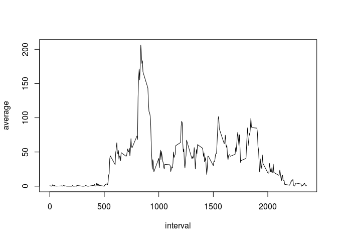
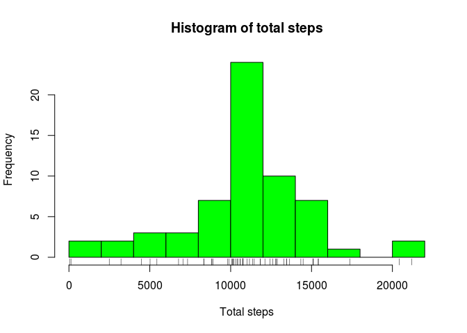

# Reproducible Research: Peer Assessment 1


##Loading and preprocessing the data


```r
library(dplyr)
```

```
## 
## Attaching package: 'dplyr'
## 
## The following object is masked from 'package:stats':
## 
##     filter
## 
## The following objects are masked from 'package:base':
## 
##     intersect, setdiff, setequal, union
```

```r
library(lubridate)
library(lattice)

activity <- read.csv("~/RCursera/RepData_PeerAssessment1-master/activity.csv")
activity$date <- as.Date(activity$date)
```
## What is mean total number of steps taken per day?

Calculate the total number of steps taken per day


```r
day <- 
  activity %>%
  group_by(date) %>%
  summarize(total = sum (steps))
```

Make a histogram of the total number of steps taken each day


```r
hist(day$total, col = "green", breaks = 10)
rug(day$total)
```

 

Calculate and report the mean and median of the total number of steps taken per day


```r
mean(day$total, na.rm = T)
```

```
## [1] 10766.19
```

```r
median(day$total, na.rm = T)
```

```
## [1] 10765
```

## What is the average daily activity pattern?

Make a time series plot (i.e. type = "l") of the 5-minute interval (x-axis) and the average number of steps taken, averaged across all days (y-axis)


```r
average <-
  activity %>%
  group_by(interval) %>%
  summarize(average = mean(steps, na.rm = T))
```


```r
plot(average$interval, average$average, type = "l")
```

 

Which 5-minute interval, on average across all the days in the dataset, contains the maximum number of steps?


```r
row_max <- filter(average, average == max(average))
row_max$interval
```

```
## [1] 835
```

## Imputing missing values

Calculate and report the total number of missing values in the dataset 


```r
row_NA <- is.na(activity$steps)
length(which(row_NA==TRUE))
```

```
## [1] 2304
```
Filling in all of the missing values


```r
na_activity <- filter(activity, is.na(steps))
new_na_activity <- merge(average, na_activity, by = "interval")
new_na_activity <- select(new_na_activity, average, date, interval)
new_na_activity <- rename(new_na_activity, steps = average)
```
Create a new dataset that is equal to the original dataset but with the missing data filled in


```r
new_activity <- bind_rows(filter(activity, !is.na(steps)), new_na_activity)
new_activity <- arrange(new_activity, date, interval)
```

Calculated histogram


```r
new_day <- 
  new_activity %>%
  group_by(date) %>%
  summarize(total = sum (steps))
```

```r
hist(new_day$total, col = "green", breaks = 10)
rug(new_day$total)
```

 
Calculated mean and median


```r
mean(new_day$total)
```

```
## [1] 10766.19
```

```r
median(new_day$total)
```

```
## [1] 10766.19
```

## Are there differences in activity patterns between weekdays and weekends?

Create a new factor variable in the dataset with two levels – “weekday” and “weekend” indicating whether a given date is a weekday or weekend day


```r
weekend <- 
  new_activity %>%
  mutate(day = wday(date, label = TRUE), week = "Weekend") %>%
  filter(day == "Sat" | day == "Sun") %>%
  group_by(interval, week) %>%
  summarize(average = mean(steps)) 

weekday <- 
  new_activity %>%
  mutate(day = wday(date, label = TRUE), week = "Weekday") %>%
  filter(day != "Sat" , day != "Sun") %>%
  group_by(interval, week) %>%
  summarize(average = mean(steps))

  
week <- bind_rows(weekend, weekday)
```


```r
xyplot(average ~ interval | week, data = week, layout = c(1, 2), type = "l")
```

 

